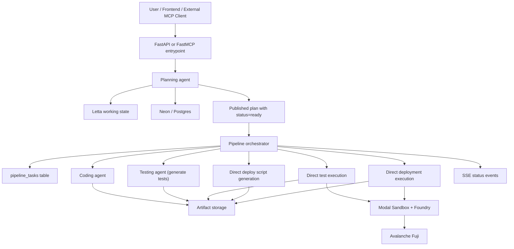

# PartyHat Agentic Pipeline Review Memo

This document explains how the current PartyHat agentic pipeline works, what technology it uses, and which design choices are most worth reviewing. It is written for an engineer who is comfortable reviewing agentic systems, orchestration, tool use, and runtime architecture.

## 1. What PartyHat is

PartyHat is a project-scoped agentic backend for turning a user-approved smart contract plan into:

- Solidity contract artifacts
- Foundry test artifacts and test execution results
- Foundry deployment scripts
- Avalanche Fuji deployment attempts and deployment records

The system has two public interfaces:

- A FastAPI backend in `agents/api.py`
- A FastMCP server in `agents/partyhat_mcp/server.py`

The main autonomous flow is implemented in `agents/agents/pipeline_orchestrator.py`.

## 2. High-level architecture

## 3. End-to-end flow

### 3.1 Planning phase

Before the autonomous pipeline starts, the planning agent collects a structured `SmartContractPlan` (`agents/schemas/plan_schema.py`).

The planning workflow is:

1. Read the current plan from memory.
2. Ask clarifying questions in small batches.
3. Save draft plan state during the conversation.
4. Validate the plan.
5. Publish the final plan with `status=ready`.

Important implementation details:

- Planning is handled by a dedicated LLM agent built in `agents/agents/planning_agent.py` and also exposed through the lazy agent registry in `agents/agents/agent_registry.py`.
- Planning tools live in `agents/agents/planning_tools.py`.
- The plan validator requires constructor `address` inputs to either have a concrete default or the sentinel value `"deployer"`.
- On FastAPI startup, OpenZeppelin MCP tools are loaded and injected into the planning toolset.

### 3.2 Pipeline start

The autonomous run is started via `POST /pipeline/run` in `agents/api.py`.

The API only allows a run when:

- `project_id` and `user_id` are real IDs, not `"default"`
- a plan exists
- the plan status is one of:
  - `ready`
  - `generating`
  - `testing`
  - `deploying`
  - `failed`

When a run starts, the orchestrator:

- creates a new `pipeline_run_id`
- emits a `pipeline_start` SSE event
- seeds the first task as:
  - `assigned_to="coding"`
  - `task_type="coding.generate_contracts"`
- attaches standardized task context including:
  - compact plan summary
  - current artifact revision
  - current artifact snapshot
  - expected outputs

### 3.3 Task-driven orchestration

The orchestrator is task-based, not a free-form multi-agent conversation.

Each pipeline run is a queue of `PipelineTask` rows in Postgres. The loop is:

1. Claim the next runnable pending task.
2. Set request-scoped contextvars for:
   - `project_id`
   - `user_id`
   - `pipeline_run_id`
   - `pipeline_task_id`
3. Update plan status to match the active stage.
4. Execute the task.
5. Require the task to resolve itself to `completed` or `failed`.
6. Validate execution metadata for direct execution stages.
7. Emit `stage_complete`.
8. Continue until a successful terminal deployment or an unrecoverable failure.

Dispatch ordering is currently FIFO, using:

- `created_at`
- `sequence_index`
- `id`

This is implemented in `claim_next_pending_task()` and mirrored by tests in `agents/tests/test_task_tools.py`. A few older comments still refer to the task structure as a stack/LIFO model, but the actual implementation is FIFO.

### 3.4 Default pipeline path

The intended autonomous path is:

1. `coding.generate_contracts`
2. `testing.generate_tests`
3. `testing.run_tests`
4. `deployment.prepare_script`
5. `deployment.execute_deploy`

There is also support for:

- `deployment.retry_deploy`
- `audit` tasks

The `audit` agent exists in the registry, but it is not part of the default seeded run path today.

## 4. Which stages are LLM-driven vs direct

One of the most important design choices in the current system is that not every stage is executed by an LLM agent.

### 4.1 LLM-driven stages

These stages are handled by DeepAgents via `stream_chat_with_intent()`:

- planning
- `coding.generate_contracts`
- `testing.generate_tests`
- audit tasks

The agents are created lazily in `agents/agents/agent_registry.py` so that:

- planning MCP tools are loaded first
- pipeline task tools are already attached
- startup side effects are minimized

### 4.2 Direct stages

These task types bypass agent streaming and are executed directly by the orchestrator:

- `testing.run_tests`
- `deployment.prepare_script`
- `deployment.execute_deploy`
- `deployment.retry_deploy`

Why this matters:

- test execution and deployment are operationally sensitive and easier to keep deterministic
- the orchestrator can enforce routing and metadata validation more tightly
- direct stages still call model-backed helpers where useful, for example deployment script generation

## 5. Agent responsibilities

### Planning agent

Purpose:

- collect requirements
- structure the plan
- validate completeness
- publish a ready plan

Key tools:

- `get_current_plan`
- `send_question_batch`
- `save_plan_draft`
- `validate_plan`
- `publish_final_plan`
- OpenZeppelin MCP tools

### Coding agent

Purpose:

- turn the validated plan into Solidity artifacts

Key tools:

- `get_current_plan`
- `get_current_artifacts`
- `generate_solidity_code`
- `save_code_artifact`
- `load_code_artifact`
- `save_coding_note`
- `ensure_chainlink_contracts`
- pipeline task tools

### Testing agent

Purpose:

- generate Foundry tests
- save test artifacts
- hand execution off to the direct test runner

Key tools:

- `generate_foundry_tests`
- `save_test_artifact`
- `run_foundry_tests`
- `save_testing_note`
- Chainlink dependency repair helpers
- pipeline task tools

### Deployment agent

Purpose:

- prepare deployment scripts
- execute deployment
- record deployment results

Key tools:

- `generate_foundry_deploy_script`
- `save_deploy_artifact`
- `run_foundry_deploy`
- `record_deployment`
- `verify_contract_on_snowtrace`
- `get_deployment_history`
- pipeline task tools

## 6. How task state is passed between stages

The system uses a normalized task context shape defined in `agents/agents/pipeline_context.py`.

Each task can carry:

- `artifact_revision`
- `plan_summary`
- `input_artifacts`
- `upstream_task`
- `failure_context`
- `expected_outputs`

This is one of the stronger parts of the design because it makes handoff data explicit instead of relying on implicit conversational state.

Notable behavior:

- a successful `coding.generate_contracts` increments `artifact_revision`
- follow-up tasks inherit the revision and artifact snapshot
- failed tasks can still create remediation tasks with structured `failure_context`
- the orchestrator stores parent/child lineage via `parent_task_id`
- tasks can also declare `depends_on_task_ids`

## 7. How agents are forced to close the loop

Non-direct stages are required to use two common tools from `agents/agents/task_tools.py`:

- `get_my_current_task()`
- `complete_task_and_create_next()`

The intended pattern is:

1. agent reads its assigned task
2. agent performs only that atomic objective
3. agent marks the task complete or failed
4. agent enqueues the next task(s)

The orchestrator verifies that this happened. If a streamed agent finishes without resolving its task through `complete_task_and_create_next()`, the pipeline is failed explicitly.

## 8. Execution and retry behavior

### Testing execution

`testing.run_tests` calls `run_foundry_tests()` directly.

Behavior:

- runs `forge test` in a Modal Sandbox
- injects standard Foundry remappings
- scopes test discovery to `test/*Test.t.sol`
- stores stdout/stderr as artifact logs
- tags results with `pipeline_run_id` and `pipeline_task_id`

If the output suggests a Chainlink dependency/remapping issue, the orchestrator:

- calls `ensure_chainlink_contracts()`
- reruns tests

Test failures are classified and routed either to:

- `testing.generate_tests` for test infrastructure issues
- `coding.generate_contracts` for contract or compile issues

### Deployment script generation

`deployment.prepare_script` is direct, but it still uses an LLM helper:

- `generate_foundry_deploy_script_direct()`

The helper receives:

- contract name
- constructor defaults
- deployment constraints
- plan summary
- concatenated contract sources

The generated script is then saved as a deploy artifact and handed off to `deployment.execute_deploy`.

### Deployment execution

`deployment.execute_deploy` and `deployment.retry_deploy` call `run_foundry_deploy()` directly.

Behavior:

- only supports `avalanche_fuji`
- requires `FUJI_RPC_URL` and `FUJI_PRIVATE_KEY`
- runs `forge script ... --broadcast` inside Modal
- redacts secrets from stdout/stderr
- parses deployment metadata from either:
  - Foundry broadcast JSON
  - stdout/stderr fallback patterns
- only treats the deployment as successful if:
  - forge exits cleanly, and
  - there is a tx hash, or a deployed address with confirmed bytecode

Failed deployment attempts are routed either to:

- `deployment.retry_deploy` for infra/config/network-style failures
- `coding.generate_contracts` for contract/script-style failures

## 9. Completion criteria

The pipeline is not considered complete just because the queue is empty.

It is only considered complete if there is a successful terminal deployment task for the run:

- `deployment.execute_deploy`
- `deployment.retry_deploy`

The success check is based on tagged deployment history in the deployment agent state, not only on the task row itself.

If no successful terminal deployment is found, the orchestrator marks the run as failed even if there are no more tasks.

There is also a hard iteration cap:

- `MAX_ITERATIONS = 10`

If the run hits the cap, the orchestrator fails the run and assumes the system may be stuck in a loop.

## 10. Persistence model

The system intentionally splits short working state from full historical records.

### 10.1 Letta

`agents/agents/memory_manager.py` uses Letta as compact project-scoped working memory.

Stored in Letta:

- user/profile/preferences
- per-agent working state
- plan status pointer
- compact plan summary
- latest artifact pointers
- last test/deploy pointers
- transient planning questions

The full plan is not kept in Letta when Neon is available. Letta mostly stores pointers and compact summaries.

### 10.2 Neon / Postgres

SQLAlchemy models in `agents/agents/db/models.py` store the durable system record:

- `users`
- `projects`
- `plans`
- `reasoning_notes`
- `agent_log`
- `test_runs`
- `deployments`
- `messages`
- `pipeline_tasks`

This is the system of record for:

- full plan JSON
- reasoning history
- agent audit trail
- test run history
- deployment history
- pipeline task history

### 10.3 Why there is both async and sync DB access

This is deliberate.

- The FastAPI and orchestrator layer use async SQLAlchemy with `asyncpg`.
- The common pipeline tools use a sync SQLAlchemy engine with `psycopg2`.

The reason is documented in `agents/agents/task_tools.py`: LangChain tool execution inside agent flows can run in contexts that would otherwise conflict with async event loops and connection pooling. The sync path is used to keep `get_my_current_task()` and `complete_task_and_create_next()` safe inside tool calls.

## 11. Artifact and log storage

Code and log artifacts are abstracted behind `agents/agents/code_storage.py`.

There are two storage modes:

- local filesystem storage
- Modal Volume storage

Artifacts are project-scoped under:

- `generated_contracts/<project_id>/...` by default

Examples:

- `contracts/*.sol`
- `test/*Test.t.sol`
- `script/*.s.sol`
- `logs/<pipeline_run_id>/<pipeline_task_id>/stdout.log`
- `logs/<pipeline_run_id>/<pipeline_task_id>/stderr.log`

If `FOUNDRY_USE_MODAL_VOLUME` is enabled, artifacts live in project-scoped Modal volumes instead of the local filesystem.

## 12. Runtime stack

### Application layer

- Python 3.12
- FastAPI
- Uvicorn
- Pydantic

### Agent layer

- OpenAI chat models via `langchain-openai`
- DeepAgents
- LangGraph `MemorySaver`

### Memory and data layer

- Letta for compact working memory
- Neon Postgres via SQLAlchemy
- `asyncpg` for async DB access
- `psycopg2-binary` for sync DB access inside tool calls
- `python-toon` for compact serialization when available

### Tooling and execution layer

- Modal
- Modal Sandbox
- Modal Volumes
- Foundry / forge
- OpenZeppelin MCP via `langchain-mcp-adapters`

### External chain target

- Avalanche Fuji only, in the current implementation

### Model defaults in code today

The main agents and generation helpers currently default to `gpt-5.2-2025-12-11`.

That includes:

- planning agent
- coding generation
- testing generation
- deployment script generation
- agent registry defaults

## 13. Important environment variables

Core runtime:

- `DATABASE_URL`
- `LETTA_API_KEY`
- `MODAL_APP_NAME`
- `FOUNDRY_SANDBOX_TIMEOUT`
- `FOUNDRY_PROJECT_ROOT`
- `FOUNDRY_ARTIFACT_ROOT`
- `FOUNDRY_USE_MODAL_VOLUME`
- `FOUNDRY_ARTIFACT_VOLUME_NAME`

Deployment:

- `FUJI_RPC_URL`
- `FUJI_PRIVATE_KEY`

Optional model overrides:

- `SOLIDITY_MODEL`
- `FOUNDRY_TEST_MODEL`
- `FOUNDRY_DEPLOY_SCRIPT_MODEL`

## 14. Interfaces exposed to callers

### FastAPI

Main endpoints relevant to the pipeline:

- `/plan/start`
- `/plan/message`
- `/plan/current`
- `/plan/approve`
- `/pipeline/run`
- `/pipeline/status`
- `/pipeline/cancel`
- `/coding/current`
- `/testing/current`
- `/deployment/current`

`/pipeline/run` streams SSE events such as:

- `pipeline_start`
- `stage_start`
- `tool_call`
- `agent_message`
- `stage_complete`
- `pipeline_complete`
- `pipeline_error`
- `pipeline_cancelled`

### MCP

The MCP server exposes higher-level tools for external agents:

- `partyhat_start_planning`
- `partyhat_generate_contract`
- `partyhat_run_tests`
- `partyhat_deploy_contract`
- `partyhat_audit_contract`

This means PartyHat is not only an internal pipeline; it is also packaged as a tool surface for other AI systems.

## 15. Current strengths

From an agent-systems perspective, the implementation already has a few strong choices:

- The pipeline is task-based and explicit, not a vague multi-agent chat loop.
- Stage handoff data is structured and normalized.
- Direct operational stages reduce unnecessary LLM freedom.
- The system keeps compact working memory separate from durable system-of-record tables.
- Artifact revisions and task lineage make retries and debugging more understandable.
- Execution logs are stored as artifacts instead of bloating memory payloads.
- The orchestrator validates that direct execution metadata matches task outcomes.

## 16. Main design questions worth expert review

These are the areas I would specifically want an agentic coding expert to comment on:

1. Cross-store consistency
   - Task state lives in Postgres, but completion semantics also depend on tagged execution history stored in agent state. Is that the right split, or should run validation be driven entirely from one durable source?

2. Sync/async boundary
   - The current sync DB path inside task tools is practical, but it adds architectural complexity. Is there a cleaner way to preserve safety inside tool execution while avoiding a dual DB access model?

3. Cancellation model
   - Pipeline cancellation is currently an in-memory set in `pipeline_cancel.py`. That works for a single process, but not for multi-instance deployment or restarts.

4. Iteration cap and recovery loop design
   - The hard cap of 10 iterations is a useful guardrail, but may be tight for real-world repair loops. Should the system move to more explicit retry budgets per task type?

5. Contract selection heuristics
   - Deployment preparation currently selects the "primary" contract by using the first contract in the plan or first coding artifact. That may be too implicit for multi-contract projects.

6. Documentation drift vs actual behavior
   - Some comments still describe older stack/LIFO behavior, while the code now uses FIFO plus direct task execution. The implementation appears more mature than a few comments suggest.

7. Scope of autonomy
   - The default autonomous run is optimized for "approved plan -> code -> tests -> deploy". Is that the right boundary, or should audit and review stages become first-class mandatory gates?

## 17. Short summary

PartyHat is currently a structured, project-scoped multi-agent pipeline for Solidity contract delivery. It uses LLM agents where reasoning is useful, direct orchestrator execution where determinism matters, Letta for compact working memory, Neon/Postgres for durable records, and Modal + Foundry for execution against Avalanche Fuji.

The architecture is already closer to a workflow engine with agentic components than to a simple chatbot with tools, which is the right direction. The main review topics are consistency across persistence layers, cancellation/retry robustness, and how far to formalize stage gates as the system grows.
